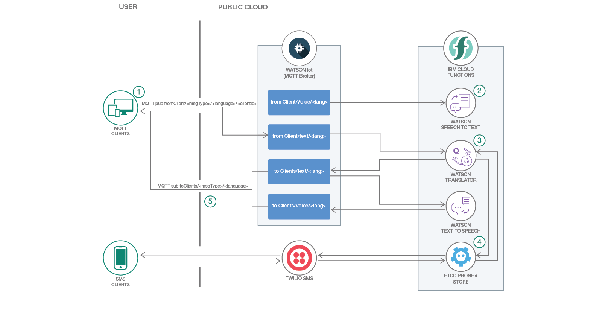

*他の言語で読む: [English](README.md).*

[](https://travis-ci.org/IBM/serverless-language-translation)

# サーバーレスの多言語対応会議室をデプロイする

このコードパターンでは、異なる国の言語を話すクライアントが互いに途切れなく意思疎通できる通信チャネルを作成する方法を提案します。OpenWhisk、Watson Text to Speech、Watson Language Translatorを使用した多言語チャットルームを作成します。

このパターンは MQTT メッセージング・プロトコルを使用して、各クライアントが 1 つ以上のチャネルを「パブリッシュ」および「サブスクライブ」できるようにします。各クライアントがリクエストで使用した言語とペイロードのタイプは、チャネルの構成によって判別されます (例えば、fromClient/french/audio)。

呼び出されるクラウド関数の順序は、メッセージの送信先チャネルによって判別されます。例えば、メッセージを fromClient/english/audio に送信すると、Watson® Speech to Text サービスを通じて音声ペイロードが実行されて、その結果が翻訳サービスに転送されます。そして翻訳サービスによる結果が、すべての参加クライアントに配信されるという仕組みです。

このコード・パターンをひと通り完了すると、以下の方法に関する理解が深まります。

* IBM Cloud Functions のアクション/トリガーをデプロイする
* Watson IoT Platform とやり取りする
* Cloud Foundry アプリケーションをセットアップする



## Flow

1. クライアントからメッセージを受信します。クライアントは Web ブラウザー、CLI、OpenWhisk アクション、SMS テキストなどです。
2. メッセージのペイロードに音声ファイルが含まれている場合は、音声がテキストに変換されます。
3. 変換されたテキストが、サポートされている他の言語に翻訳されます。
4. SMS からメッセージが送信された場合は、送信者の電話番号が etcd キー・バリュー型ストアに追加されます。この例では etcd を使用して、サブスクライバーの電話番号と言語のリストを保持します。また、調整可能な TTL 値を使用して、サブスクライバーが 300 秒以上会話に参加していない場合、そのサブスクライバーの電話番号を削除します。
5. 翻訳されたメッセージ/音声ストリームが MQTT ブローカー上のさまざまなチャネルにパブリッシュされると、MQTT ブローカーによってサブスクライブ済みクライアントにメッセージが配信されます。

## 含まれるコンポーネント

* [OpenWhisk](https://console.ng.bluemix.net/openwhisk): 拡張性の高いサーバーレス環境でオンデマンドでコードを実行できます。
* [Watson Text to Speech](https://www.ibm.com/watson/jp-ja/developercloud/text-to-speech.html): テキストから自然な音声を合成します。
* [Watson Language Translator](https://www.ibm.com/watson/jp-ja/developercloud/language-translator.html): コンテンツのテキストを、ある言語から別の言語にリアルタイムで翻訳します。

## 利用した技術

* [Messaging](https://developer.ibm.com/messaging/message-hub/): メッセージングは、マイクロサービスなどの緩やかに分離されたアーキテクチャパターンを使用する最新のアプリケーションにとって重要な技術です。
* [Node.js](https://nodejs.org/): サーバー側のJavaScriptコードを実行するためのオープンソースのJavaScriptランタイム環境です。
* [OpenWhisk](https://www.ibm.com/cloud-computing/bluemix/openwhisk): イベントに応答してコードを実行できるオープンソースのイベント駆動型プラットフォームです。 これはIBMクラウド機能の基盤技術です。

# ビデオを観る
[](https://www.youtube.com/watch?v=eXY0uh_SeKs)

## 前提条件
ホストされたオファリングと対話するには、IBM Cloud CLIを事前にインストールする必要があります。 最新のCLIリリースは
 [こちら](https://console.bluemix.net/docs/cli/reference/bluemix_cli/download_cli.html#download_install) にあります。インストール用スクリプトは上記のリンクで管理されており、以下のいずれかのコマンドで実行できます。

```
# Mac OSX
curl -fsSL https://clis.ng.bluemix.net/install/osx | sh

# Linux
curl -fsSL https://clis.ng.bluemix.net/install/linux | sh

# Powershell
iex(New-Object Net.WebClient).DownloadString('https://clis.ng.bluemix.net/install/powershell')
```
インストールが完了したら、バージョンを表示してCLIが動作していることを確認します
```
bx -v
```
"Cloud Functions" プラグインもインストールしてください
```
bx plugin install Cloud-Functions -r Bluemix
```

IBM Cloud Cliがすでにインストールされている場合、Cloud Functionsプラグインが最新のバージョンであることを確認してください
```
bx plugin update cloud-functions
```


# 手順
1. [サービスの作成](#1-create-services)
2. [MQTT Feed のデプロイ](#2-deploy-mqtt-feed)
3. [Actions のアップロード](#3-upload-actions)
4. [Triggers の作成](#4-create-triggers)
5. [Rules の作成](#5-create-rules)
6. [UI のデプロイ](#6-deploy-ui)

<a name="1-create-services"></a>
### 1. サービスの作成

必要な IBM Cloud サービスを作成します。
- [Speech To Text](https://console.bluemix.net/catalog/services/speech-to-text)
- [Text To Speech](https://console.bluemix.net/catalog/services/text-to-speech)
- [Watson IoT Platform](https://console.bluemix.net/catalog/services/internet-of-things-platform)
- [Watson Language Translator](https://console.bluemix.net/catalog/services/language-translator)

SMS統合のため、次のサードパーティ・サービスを作成します。

- [Twilio](https://console.bluemix.net/catalog/services/twilio-programmable-sms)
- [Redis](https://console.bluemix.net/catalog/services/redis-cloud)

各サービスは、以下の手順でプロビジョニング(準備)できます。

[https://console.bluemix.net/](https://console.bluemix.net/) の IBM Cloud ダッシュボードに移動し、右上の `Catalog` ボタンをクリックします。
<p align="center">

</p>

サービスの名前を入力し、結果欄のアイコンを選択します。
<p align="center">

</p>

料金プランを選択して `Create` をクリックします。 IBM Liteアカウントに導入する場合は、無料の `Lite` プランを選択してください。
<p align="center">

</p>

#### 追加の設定: Watson IoTサービスの資格情報を生成する

プロビジョニングされた後、Watson IoT Platformサービスは、ブローカに接続するための一連の資格情報を生成する必要があるため、追加の構成が必要になります。 IoT Platformダッシュボードに入り、左側のメニューから `DEVICE` を選択し `Add Device` ボタンをクリックしてください。

<p align="center">

</p>

次に、デバイスタイプとIDを指定します。
<p align="center">

</p>

その後のいくつかのタブ(デバイス情報、グループ、セキュリティ)はデフォルト設定のままで大丈夫です。

<p align="center">

</p>

`Finish` ボタンをクリックすると、デバイスが登録され、メッセージをIoTプラットフォームに公開するために使用できる一連の認証情報が生成されます。デバイスのタイプとデバイスIDを記録し、両方を `cfcreds.env` ファイルに記載します。

MQTT Brokerをパブリッシュしてサブスクライブできるようにするため、異なる資格証明セットを生成する必要があります。左のメニューで `APPS` オプションを選択し、次に `Generate API Key` ボタンをクリックします。

<p align="center">

</p>

`Information` 欄は空白のままにして次へ進みます。
`Permissions` (権限)タブでは、`Backend Trusted Application` (バックエンドの信頼済みアプリケーション)ロールを選択します。選択後は `Generate Key` をクリック。

<p align="center">

</p>

その結果、APIキーと認証トークンが得られます。これらは、MQTTクライアントのユーザー名とパスワードとして使用します。設定を少し簡単にするには、これらの値を `IOT_API_KEY` および `IOT_APP_AUTH_TOKEN` として `cfcreds.env` ファイルに記載します。

<p align="center">

</p>

`IOT_ORG_ID`、`IOT_DEVICE_TYPE`、`IOT_DEVICE_ID`、`IOT_AUTH_TOKEN`、`IOT_API_TOKEN` の値は、cfcreds.env ファイルに記載したはずです。この例では、npm [mqtt.js](https://www.npmjs.com/package/mqtt) パッケージを使用しました。このパッケージは `npm install -g mqtt` でインストールすることができます。次に、MQTT publish/subscribe コマンドをテスト実行して、信任状が有効であることを確認します。

1つのタブでMQTTブローカーを登録する
```
source cfcreds.env
mqtt_sub -i "a:${IOT_ORG_ID}:test" -u "${IOT_API_KEY}" -P "${IOT_AUTH_TOKEN}" -h "${IOT_ORG_ID}.messaging.internetofthings.ibmcloud.com" -p 1883 -t "iot-2/type/${IOT_DEVICE_TYPE}/id/${IOT_DEVICE_ID}/evt/fromClient/fmt/json"

```

そして、別のタブで公開する
```
source cfcreds.env
mqtt_pub -i "a:${IOT_ORG_ID}:client_pub" -u "${IOT_API_KEY}" -P "${IOT_AUTH_TOKEN}" -h 'agf5n9.messaging.internetofthings.ibmcloud.com' -p 1883 -t "iot-2/type/${IOT_DEVICE_TYPE}/id/${IOT_DEVICE_ID}/evt/fromClient/fmt/json" -m '{
    "d" : {
          "sourceLanguage" : "en",
          "payload" : "test",
	        "client": "client1"
    }
}'
```

<a name="2-deploy-mqtt-feed"></a>
### 2. MQTT Feed のデプロイ

openwhisk-package-mqtt-watson サブモジュールにある [こちら](https://github.com/kkbankol-ibm/openwhisk-package-mqtt-watson) の MQTT Feedパッケージをインストールします。この "Feed" により、OpenWhiskは1つ以上のMQTTトピックをサブスクライブし、受信メッセージに応答してアクションを呼び出すことができます。フィードがIBM Cloud機能とどのように機能するかについては、これらの  [ドキュメント](https://github.com/apache/incubator-openwhisk/blob/master/docs/feeds.md) を参照してください。

<a name="3-upload-actions"></a>
### 3. Actions のアップロード
次のコマンドを使用して、各 "Action" をCloud Functionsコードベースにアップロードします。
```
bx wsk action create translateText translateText.js
bx wsk action create sendSMS sendSMS.js
bx wsk action create iotPub iotPub.py
bx wsk action create handleIncomingSMS handleIncomingSMS.js
```

各 "Action" が作成された後、対応するサービスのデフォルトの資格情報を設定もしくはバインドします。
```
# Most IBM Cloud native service credentials can be easily imported to a Cloud function using the "service bind" command
# bx wsk service bind <service> <action_name>
bx wsk service bind language_translator translateText
bx wsk service bind language_translator handleIncomingSMS


# Credentials for the Watson IoT Platform and third party services can be set using the "update command"
# bx wsk action update <action_name> -p <param_name> <param_value>
bx wsk action update iotPub -p iot_org_id "${IOT_ORG_ID}" -p iot_device_id "${IOT_DEVICE_ID}" -p iot_device_type "${IOT_DEVICE_TYPE}" -p iot_auth_token "${IOT_AUTH_TOKEN}" -p iot_api_key "${IOT_API_KEY}"
bx wsk action update sendSMS -p twilioNumber "${TWILIO_NUMBER}" -p twilioSid "${TWILIO_SID}" -p twilioAuthToken "${TWILIO_AUTH_TOKEN}" -p redisUsername "${REDIS_USER}" -p redisPassword "${REDIS_PASSWORD}" -p redisHost "${REDIS_HOST}" -p redisPort "${REDIS_PORT}"
bx wsk action update handleIncomingSMS -p twilioNumber "${TWILIO_NUMBER}" -p twilioSid "${TWILIO_SID}" -p twilioAuthToken "${TWILIO_AUTH_TOKEN}" -p redisUsername "${REDIS_USER}" -p redisPassword "${REDIS_PASSWORD}" -p redisHost "${REDIS_HOST}" -p redisPort "${REDIS_PORT}"
```

<a name="4-create-triggers"></a>
### 4. Triggers の作成
イベントを表現する各 "Trigger" を作成します。
```
bx wsk trigger create audioMsgReceived
bx wsk trigger create txtMsgReceived
bx wsk trigger create SMSMsgReceived
bx wsk trigger create msgTranslated
```

<a name="5-create-rules"></a>
### 5. Rules の作成
特定の "Trigger" がアクティブになったときに "Action" を実行する各 "Rule" を作成します。
```
# bx wsk rule create RULE_NAME TRIGGER_NAME ACTION_NAME
bx wsk rule create handleTxtMessage txtMsgReceived translateText
bx wsk rule create handleMQTTMessage mqttMsgReceived translateText
bx wsk rule create publishtoIOT msgTranslated iotPub
bx wsk rule create publishtoSMS msgTranslated sendSMS
```

フィードがデプロイされ、"Rule" が確立されたら、以下のようにフィードに登録されたトピックにMQTTメッセージを送信してプロセスをテストします。
```
source cfcreds.env
mqtt_pub -i "a:${IOT_ORG_ID}:client_pub" -u "${IOT_API_KEY}" -P "${IOT_AUTH_TOKEN}" -h 'agf5n9.messaging.internetofthings.ibmcloud.com' -p 1883 -t "iot-2/type/${IOT_DEVICE_TYPE}/id/${IOT_DEVICE_ID}/evt/fromClient/fmt/json" -m '{
    "d" : {
          "sourceLanguage" : "en",
          "payload" : "test",
	        "client": "client1"
    }
}'
```

このコマンドが発行されるとすぐに、一連のアクションとトリガーが呼び出されることが Cloud Functions のログで確認できるはずです。このログは [https://console.bluemix.net/openwhisk/dashboard](https://console.bluemix.net/openwhisk/dashboard) にアクセスするか、別のタブで `bx wsk activation poll` を実行することで表示できます 。

<a name="6-deploy-ui"></a>
### 6. UI のデプロイ

もしサーバー側のロジックだけが必要であれば、ここで手順は終了です。

ただし、オプションで https://github.com/IBM/language-translation-ui で提供されるUIをデプロイできます。この UI は `IOT_ORG_ID`、`IOT_DEVICE_TYPE`、`IOT_DEVICE_ID`、`IOT_AUTH_TOKEN`、`IOT_API_TOKEN` の値が環境変数に定義されていることを期待して動作しますので、`cfcreds.env` ファイルをあらかじめ用意しておいてください。

```
git clone https://github.com/IBM/language-translation-ui
cd language-translation-ui
npm install
npm start
```

npm startコマンドが成功すると、http://127.0.0.1:8080 でUIにアクセスできるはずです。

## 開発者向けノート

Flow:

- トピックへのJSONオブジェクトとして受信されたMQTTメッセージ `iot-2/type/'${deviceType}/id/${orgId}/evt/${eventName}/fmt/json`
```
{
  client: "client_1234",
  payload: "hello",
  sourceLanguage: "en"
}
```

- トピックに関連付けられた "Trigger" は、メッセージのペイロード/言語をトランスレータの "Action" に転送します。
- トランスレータ "Action" は、ループを介してメッセージペイロードを渡します。各アイテムは、元のメッセージが翻訳される言語です。翻訳が完了すると、別のトリガーが起動され、2つの他の「公開」Actionが同時に開始されます。
    - ある "Action" はすべてのMQTTクライアントに結果を公開します。
    - もう1つの "Action" は、RedisのSMS加入者番号/言語を検索し、結果をTwilio経由で送信します。

# ライセンス
[Apache 2.0](LICENSE)
